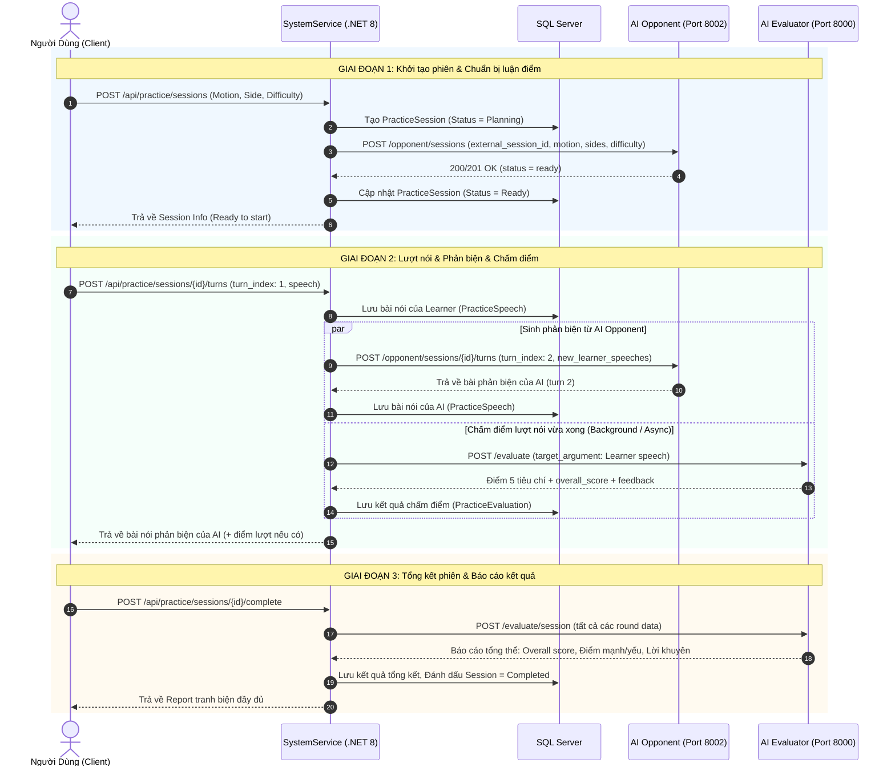

# Kế Hoạch Tích Hợp 2 AI Service Vào Main Flow (.NET 8 Backend)

> **Tài liệu đặc tả kiến trúc & lộ trình triển khai**  
> **Mục tiêu**: Tích hợp **AI Opponent Service** (sinh bài phản biện - Port 8002) và **AI Evaluator Service** (chấm điểm tranh biện - Port 8000) vào hệ thống backend chính .NET 8 (`SystemService` & `Gateway`).

---

## 1. Tổng quan Kiến trúc

```
+-----------------------------------------------------------------------+
|                            CLIENT (Web / App)                         |
+-----------------------------------^-----------------------------------+
                                    | HTTPS / WSS
                                    v
+-----------------------------------------------------------------------+
|                    YARP API Gateway (.NET 8 - Port 5000)              |
+-----------------------------------^-----------------------------------+
                                    | HTTP
                                    v
+-----------------------------------------------------------------------+
|              Main Backend - SystemService (.NET 8 - Port 5001)        |
|  - Auth, User, Competition                                           |
|  - Practice Session Orchestrator (Quản lý trạng thái, lịch sử)         |
|  - Typed HttpClients + Polly Resiliency Policy                        |
|  - SQL Server (EF Core 8) + Redis Cache                               |
+-------------------^-------------------------------^-------------------+
                    | HTTP (Port 8002)              | HTTP (Port 8000)
                    v                               v
+---------------------------------------+ +-----------------------------+
|    AI Opponent Service (FastAPI)      | | AI Evaluator Service (FastAPI)
|    - Port: 8002                       | | - Port: 8000                |
|    - Case Planning (Dàn ý trước trận) | | - Argument Evaluation       |
|    - Counter-Speech Generator (Turns) | | - Round Evaluation          |
|    - Stance Reviewer                  | | - Session Summary           |
+---------------------------------------+ +-----------------------------+
```

---

## 2. Thông số & API Contracts của 2 AI Service

### 2.1. AI Opponent Service (Port 8002)

| Phương thức & Endpoint | Mục đích | Payload chính | Kết quả trả về |
|---|---|---|---|
| `POST /opponent/sessions` | Khởi tạo phiên tranh biện & Lập Case Plan trước trận (Idempotent theo `external_session_id`) | `{ "external_session_id": "...", "motion": "...", "learner_side": "affirmative", "ai_side": "negative", "difficulty": "medium", "language": "vi" }` | `{ "opponent_session_id": "...", "status": "ready" }` |
| `POST /opponent/sessions/{external_session_id}/turns` | Gửi bài nói của learner để AI phản biện theo lượt | `{ "turn_index": 2, "new_learner_speeches": [{ "turn_index": 1, "text": "..." }] }` | `{ "turn_index": 2, "speaker": "ai", "speech": "...", "round_type": "opening" }` |
| `GET /opponent/sessions/{external_session_id}/case-plan` | Lấy chi tiết Case File đã lập (Debug/View) | Không | Dàn ý, luận điểm, bằng chứng dự kiến của AI |

### 2.2. AI Evaluator Service (Port 8000)

| Phương thức & Endpoint | Mục đích | Payload chính | Kết quả trả về |
|---|---|---|---|
| `POST /evaluate` | Chấm điểm 1 lượt nói đơn lẻ (Argument) | `{ "motion": "...", "target_argument": { "speaker": "learner", "text": "...", "side": "affirmative" }, "opponent_argument_text": "..." }` | 5 tiêu chí (1-5đ), `overall_score` (0-10đ), giải thích & gợi ý |
| `POST /evaluate/round` | Chấm điểm 1 giai đoạn (Opening / Rebuttal / Closing) | `{ "motion": "...", "stage": "rebuttal", "turns": [...] }` | `round_score` (0-10đ), độ nhất quán, chi tiết từng tiêu chí |
| `POST /evaluate/session` | Đánh giá tổng kết toàn bộ phiên | `{ "motion": "...", "rounds": [...] }` | `overall_score`, tiến độ (trend), điểm mạnh, điểm yếu |

---

## 3. Luồng Nghiệp Vụ Chuẩn (Practice Lifecycle)



---

## 4. Thiết Kế Cơ Sở Dữ Liệu (`SystemService.DAL`)

Cần bổ sung các bảng sau vào Entity Framework Core 8:

### 4.1. Bảng `PracticeSessions`
- `Id` (Guid, PK): Unique Session ID (chính là `external_session_id`).
- `UserId` (Guid, FK): Người dùng thực hành.
- `Motion` (NVarChar(500)): Đề tài tranh biện.
- `LearnerSide` (NVarChar(20)): `affirmative` / `negative`.
- `AiSide` (NVarChar(20)): `negative` / `affirmative`.
- `Difficulty` (NVarChar(20)): `easy` / `medium` / `hard`.
- `Language` (NVarChar(10)): `vi` / `en`.
- `Status` (NVarChar(20)): `Planning` -> `Ready` -> `InProgress` -> `Completed` -> `Failed`.
- `OverallScore` (Decimal(4,2), Nullable): Điểm tổng kết phiên.
- `CreatedAt`, `UpdatedAt` (DateTimeOffset).

### 4.2. Bảng `PracticeSpeeches`
- `Id` (Guid, PK).
- `SessionId` (Guid, FK).
- `TurnIndex` (Int): 1 đến 6.
- `Speaker` (NVarChar(20)): `learner` / `ai`.
- `RoundType` (NVarChar(30)): `opening` / `rebuttal` / `closing`.
- `Content` (NVarChar(MAX)): Nội dung bài nói.
- `CreatedAt` (DateTimeOffset).

### 4.3. Bảng `PracticeEvaluations`
- `Id` (Guid, PK).
- `SessionId` (Guid, FK).
- `SpeechId` (Guid, FK, Nullable): Áp dụng cho cấp Argument.
- `EvaluationType` (NVarChar(20)): `Argument` / `Round` / `Session`.
- `Stage` (NVarChar(30), Nullable): `opening` / `rebuttal` / `closing`.
- `LogicScore`, `EvidenceScore`, `RelevanceScore`, `StructureScore`, `PersuasivenessScore` (Decimal(3,1)).
- `OverallScore` (Decimal(4,2)).
- `FeedbackJson` (NVarChar(MAX)): Lưu trữ giải thích chi tiết, điểm mạnh, điểm yếu theo JSON.
- `CreatedAt` (DateTimeOffset).

---

## 5. Lộ Trình Triển Khai (5 Giai đoạn)

### Giai đoạn 1: Chuẩn bị Cấu hình & Network
- [ ] Khai báo cấu hình endpoint của 2 service trong `appsettings.json` (`SystemService`):
  ```json
  "AiServices": {
    "OpponentUrl": "http://localhost:8002",
    "EvaluatorUrl": "http://localhost:8000",
    "TimeoutSeconds": 90
  }
  ```
- [ ] Cấu hình reverse proxy trong `Gateway/appsettings.json` (nếu cần route mở rộng).

### Giai đoạn 2: Data Model & Repository (`SystemService.DAL`)
- [ ] Tạo Entities: `PracticeSession`, `PracticeSpeech`, `PracticeEvaluation`.
- [ ] Cấu hình Fluent API trong `SystemDbContext`.
- [ ] Tạo và chạy EF Core Migration (`Add-Migration AddPracticeDebateModule`).
- [ ] Tạo Repositories và Interfaces tương ứng.

### Giai đoạn 3: Tích hợp HTTP Client & Resilience (`SystemService.BLL`)
- [ ] Cài đặt hoặc dùng sẵn `HttpClientFactory` + Polly (Retry 3 lần khi 429 hoặc timeout).
- [ ] Xây dựng DTOs mapping chuẩn với Schema của 2 service Python (Pydantic models).
- [ ] Triển khai `AiOpponentClient` (`IAiOpponentClient`).
- [ ] Triển khai `AiEvaluatorClient` (`IAiEvaluatorClient`).

### Giai đoạn 4: Nghiệp Vụ Quản Lý Phiên Tranh Biện (`SystemService.BLL`)
- [ ] Xây dựng `IPracticeSessionService`:
  - `StartSessionAsync(...)`: Tạo session, trigger AI Opponent lập Case Plan.
  - `SubmitTurnAsync(...)`: Nhận bài nói learner, song song gọi Opponent phản biện + Evaluator chấm điểm.
  - `CompleteSessionAsync(...)`: Tổng hợp báo cáo toàn trận.
  - `GetSessionHistoryAsync(...)`: Xem lại lịch sử các trận đấu và điểm số.

### Giai đoạn 5: Controller Endpoints & Kiểm Thử Toàn Trình
- [ ] Tạo `PracticeController` trong `SystemService`.
- [ ] Kiểm thử End-to-End:
  1. Test gọi `POST /api/practice/sessions` và kiểm tra bên Opponent log case planning.
  2. Test learner nói lượt 1, kiểm tra nhận bài nói phản biện lượt 2 và điểm số lượt 1.
  3. Hoàn tất 6 lượt, kiểm tra tổng kết session score.
- [ ] Xử lý ngoại lệ: Khi AI quá tải (504, 429), lỗi mạng, hoặc Stance Reviewer cảnh báo lệch phe.
